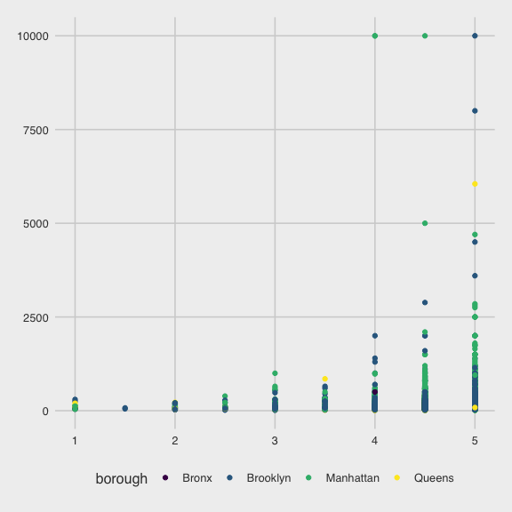
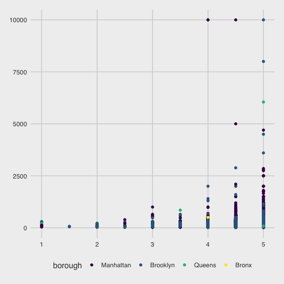

Linear Models
================
Alexey Abramov
11/23/2020

  - [Setup](#setup)
  - [Loading the data.](#loading-the-data.)
  - [Fit a Model](#fit-a-model)
      - [Be in control of factors](#be-in-control-of-factors)

# Setup

``` r
library(tidyverse)
```

    ## ── Attaching packages ─────────────────────────────────────── tidyverse 1.3.0 ──

    ## ✓ ggplot2 3.3.2     ✓ purrr   0.3.4
    ## ✓ tibble  3.0.3     ✓ dplyr   1.0.2
    ## ✓ tidyr   1.1.2     ✓ stringr 1.4.0
    ## ✓ readr   1.3.1     ✓ forcats 0.5.0

    ## ── Conflicts ────────────────────────────────────────── tidyverse_conflicts() ──
    ## x dplyr::filter() masks stats::filter()
    ## x dplyr::lag()    masks stats::lag()

``` r
library(p8105.datasets)

knitr::opts_chunk$set(
  fig.width = 6,
  fig.height = 6,
  out.width = "90%"
)

theme_set(
  ggthemes::theme_fivethirtyeight() + theme(legend.position = "bottom")
  )

options(
  ggplot2.continuous.colour = "viridis",
  ggplot2.continuous.colour = "viridis"
)

scale_colour_discrete = scale_color_viridis_d
scale_fill_discrete = scale_fill_viridis_d
```

# Loading the data.

``` r
data("nyc_airbnb")

nyc_airbnb =
  nyc_airbnb %>% 
    mutate(
      stars = review_scores_location/ 2) %>% 
  rename(
      borough = neighbourhood_group,
      neighborhood = (neighbourhood)) %>% 
  filter(borough != "Staten Island") %>% 
  select(price, stars, borough, neighborhood, room_type)
```

# Fit a Model

``` r
nyc_airbnb %>%  
  ggplot(aes(x = stars, y = price, color = borough)) +
  geom_point()
```

    ## Warning: Removed 9962 rows containing missing values (geom_point).



``` r
airbnbn_price_fit = lm(price ~ stars + borough, data = nyc_airbnb)
summary(airbnbn_price_fit)
```

    ## 
    ## Call:
    ## lm(formula = price ~ stars + borough, data = nyc_airbnb)
    ## 
    ## Residuals:
    ##    Min     1Q Median     3Q    Max 
    ## -169.8  -64.0  -29.0   20.2 9870.0 
    ## 
    ## Coefficients:
    ##                  Estimate Std. Error t value Pr(>|t|)    
    ## (Intercept)       -70.414     14.021  -5.022 5.14e-07 ***
    ## stars              31.990      2.527  12.657  < 2e-16 ***
    ## boroughBrooklyn    40.500      8.559   4.732 2.23e-06 ***
    ## boroughManhattan   90.254      8.567  10.534  < 2e-16 ***
    ## boroughQueens      13.206      9.065   1.457    0.145    
    ## ---
    ## Signif. codes:  0 '***' 0.001 '**' 0.01 '*' 0.05 '.' 0.1 ' ' 1
    ## 
    ## Residual standard error: 181.5 on 30525 degrees of freedom
    ##   (9962 observations deleted due to missingness)
    ## Multiple R-squared:  0.03423,    Adjusted R-squared:  0.03411 
    ## F-statistic: 270.5 on 4 and 30525 DF,  p-value: < 2.2e-16

Better way to do it?

``` r
broom::glance(airbnbn_price_fit)
```

    ## # A tibble: 1 x 12
    ##   r.squared adj.r.squared sigma statistic   p.value    df  logLik    AIC    BIC
    ##       <dbl>         <dbl> <dbl>     <dbl>     <dbl> <dbl>   <dbl>  <dbl>  <dbl>
    ## 1    0.0342        0.0341  182.      271. 6.73e-229     4 -2.02e5 4.04e5 4.04e5
    ## # … with 3 more variables: deviance <dbl>, df.residual <int>, nobs <int>

Another good way

``` r
broom::tidy(airbnbn_price_fit) %>% 
  select(-std.error, -statistic) %>% 
  mutate(
    term = str_replace(term, "borough", "Borough = ")) %>% 
      knitr::kable(digits = 3)
```

| term                | estimate | p.value |
| :------------------ | -------: | ------: |
| (Intercept)         | \-70.414 |   0.000 |
| stars               |   31.990 |   0.000 |
| Borough = Brooklyn  |   40.500 |   0.000 |
| Borough = Manhattan |   90.254 |   0.000 |
| Borough = Queens    |   13.206 |   0.145 |

## Be in control of factors

Note that the Bronx is the reference group… because it’s in alphabetical
order… and that’s bcause borough is a character.

How do we do it so the most common borough? Instead of alphabetical

``` r
nyc_airbnb = 
  nyc_airbnb %>% 
  mutate(
    borough = fct_infreq(borough),
    room_type = fct_infreq(room_type)
    )
```

``` r
nyc_airbnb %>%  
  ggplot(aes(x = stars, y = price, color = borough)) +
  geom_point()
```

    ## Warning: Removed 9962 rows containing missing values (geom_point).



So now we can see that the reference group is Manhattan, and not the
Bronx\! A more plausible group.

``` r
airbnbn_price_fit2 = lm(price ~ stars + borough, data = nyc_airbnb)
broom::tidy(airbnbn_price_fit2)
```

    ## # A tibble: 5 x 5
    ##   term            estimate std.error statistic   p.value
    ##   <chr>              <dbl>     <dbl>     <dbl>     <dbl>
    ## 1 (Intercept)         19.8     12.2       1.63 1.04e-  1
    ## 2 stars               32.0      2.53     12.7  1.27e- 36
    ## 3 boroughBrooklyn    -49.8      2.23    -22.3  6.32e-109
    ## 4 boroughQueens      -77.0      3.73    -20.7  2.58e- 94
    ## 5 boroughBronx       -90.3      8.57    -10.5  6.64e- 26
